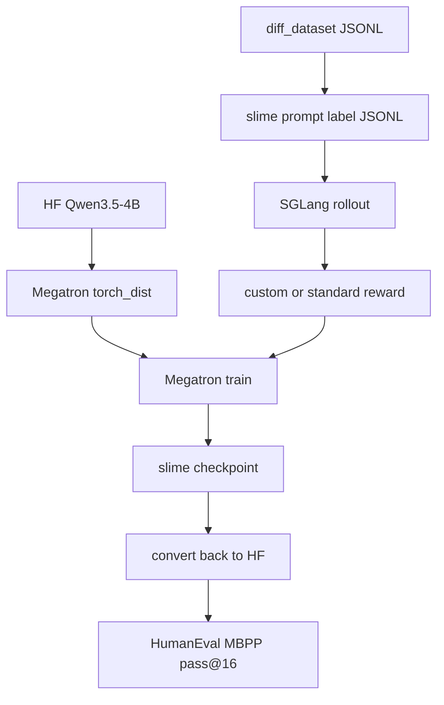

# Slime 框架迁移与加速计划

## 我读到的可利用能力

- 工具链：`[tools/convert_hf_to_torch_dist.py](/mnt/data/distribution-matching-slime/code/slime-0.2.4/tools/convert_hf_to_torch_dist.py)`、`[tools/convert_torch_dist_to_hf.py](/mnt/data/distribution-matching-slime/code/slime-0.2.4/tools/convert_torch_dist_to_hf.py)`、parallel/bridge 转换器、FP8/INT4 工具、rollout profile/replay/timeline 工具。
- 主工作流：`[train.py](/mnt/data/distribution-matching-slime/code/slime-0.2.4/train.py)` 是同步 “rollout -> train -> update weights”；`[train_async.py](/mnt/data/distribution-matching-slime/code/slime-0.2.4/train_async.py)` 能把下一批 rollout 和当前训练重叠，但不能 colocate。
- 扩展点：custom generate、custom RM、batched group RM、custom reward post-process、custom convert samples to train data，主要接在 `[slime/ray/rollout.py](/mnt/data/distribution-matching-slime/code/slime-0.2.4/slime/ray/rollout.py)` 与 `[slime/rollout/sglang_rollout.py](/mnt/data/distribution-matching-slime/code/slime-0.2.4/slime/rollout/sglang_rollout.py)`。
- 加速旋钮：`train_async`、fully async 示例、`--use-dynamic-batch-size`、`--max-tokens-per-gpu`、`--balance-data`、`--update-weights-interval`、`--use-rollout-logprobs`、`--async-save`、SGLang `--sglang-*` 参数、`--sglang-server-concurrency`、`--sglang-mem-fraction-static`、multi-node、colocate/offload。

## Review 当前路线

当前 Route B 方向是对的：用 `[scripts/diff_dataset/prepare_code_datasets.py](/mnt/data/ebft-distribution-new/code/scripts/diff_dataset/prepare_code_datasets.py)` 复用数据，用 slime 训练，再转 HF 接 `[scripts/benchmarks/run_code_generation_benchmarks.py](/mnt/data/ebft-distribution-new/code/scripts/benchmarks/run_code_generation_benchmarks.py)`。

主要问题是：现有 EBFT 的核心不是普通标量 reward，而是 strided block 生成、critic hidden-state、block 级 pointwise/CF/teacher reward、RLOO baseline。slime 默认是整段 completion 的标量 reward + GRPO/GSPO group normalization。因此第一阶段不要声称等价 G1/G2/G3，只做高速 slime baseline 和近似 EBFT reward。

## Re-plan

1. 先跑标准 slime 快速闭环：只使用当前 train/eval JSONL、HF↔Megatron 转换、`train.py` 或 `train_async.py` 小步数，确认 checkpoint、SGLang rollout、HF 评测全通。
2. 单因子打开加速项：先测 `train_async` 非 colocate，再测 dynamic batch、`max_tokens_per_gpu`、SGLang concurrency/mem、`update_weights_interval`、`use_rollout_logprobs`、`async_save`。每次只改一类旋钮，记录 rollout time、train time、weight update time、GPU 利用率。
3. 奖励迁移分三层：先用 batched custom RM 做整段 pointwise/CF 近似；再加 custom reward post-process 模拟 EBFT RLOO；最后如确实需要等价，再做 custom generate + custom convert train data，恢复 strided block 与 per-token/per-block reward。
4. 评测口径固定：slime 内置 eval 只当训练监控，正式比较只用当前 HF code benchmark，输出 baseline/G1/G2/G3/slime 的 HumanEval 与 MBPP pass@16。
5. 最后再考虑完整 EBFT：迁移 critic feature extractor、teacher responses、CF teacher/vicinal、G3 adapter/EMA。这个阶段优先追求行为一致，不再优先追求最小改动。

## 执行原则

- 不直接改 OpenRLHF G1/G2/G3 主脚本；新 slime 入口独立保留。
- 先追 wall-clock 加速，再追 reward 等价。
- 所有性能结论必须配 profiling：SGLang rollout、Megatron train、weight update、checkpoint 四段拆开看。

