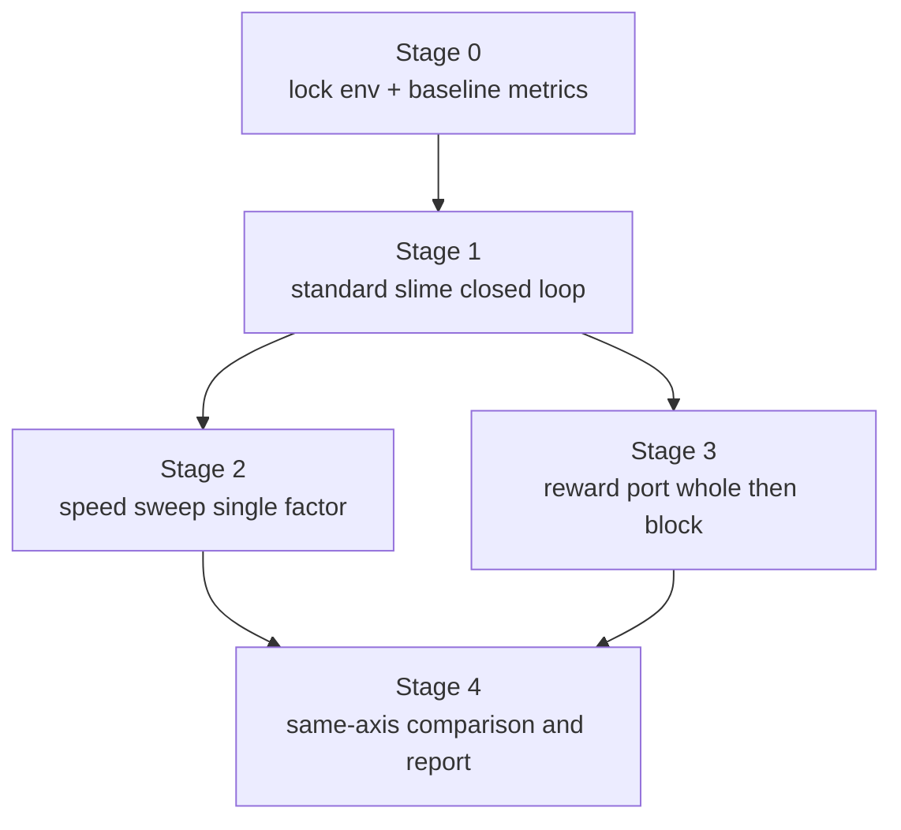

# Slime 加速迁移 v2

## Review 改动摘要

修复 v1 的 12 个问题：补 Stage 0 环境锁定与基线测量、把异步与 colocate 解耦、明确每个奖励迁移层的 stop 准则、加 round-trip sanity check、加失败回退、写清可并行的 agent 分工。

## Re-plan 全景

## Stage 0 锁定环境与基线（前置必做）

- 锁定一份 `MODEL_ARGS_SCRIPT`：优先使用 `[slime/scripts/models/qwen3.5-4B.sh](/mnt/data/distribution-matching-slime/code/slime-0.2.4/slime/scripts/models/qwen3.5-4B.sh)`，禁止再用 `run_slime_gspo_1node_once.sh` 自动从 `config.json` 推断的分支，避免 vocab/rotary 漂移。
- 写一份 `audit_slime_env.py`/脚本，校验：slime version、Megatron commit、SGLang version、sgl-kernel、`mbridge`、CUDA、`PYTHONPATH`、`/mnt/data/models/Qwen3.5-4B/config.json`、torch_dist `common.pt`、`latest_checkpointed_iteration.txt`。
- 用现有 `[scripts/diff_dataset/run_G2_rebase_no_teacher_distribution_1node_once.sh](/mnt/data/ebft-distribution-new/code/scripts/diff_dataset/run_G2_rebase_no_teacher_distribution_1node_once.sh)` 跑 N 个 step，记录 EBFT 基线四段时间：rollout、make_experience、actor train、save。后面所有 slime 数字都要和它同口径对比。
- 输出 `baselines.tsv`：列为 step time、rollout time、weight sync time、GPU util、pass@16(HE/MBPP)。

## Stage 1 标准 slime 闭环（不动任何 reward）

- 数据：复用 `[scripts/diff_dataset/prepare_code_datasets.py](/mnt/data/ebft-distribution-new/code/scripts/diff_dataset/prepare_code_datasets.py)` + `[scripts/diff_dataset/prepare_slime_jsonl.py](/mnt/data/ebft-distribution-new/code/scripts/diff_dataset/prepare_slime_jsonl.py)`。
- 训练：`[scripts/diff_dataset/run_slime_gspo_1node_once.sh](/mnt/data/ebft-distribution-new/code/scripts/diff_dataset/run_slime_gspo_1node_once.sh)` 关闭 `USE_EBFT_CUSTOM_RM`，`RM_TYPE=deepscaler`，small steps（NUM_ROLLOUT≈10）。
- Checkpoint：`[scripts/diff_dataset/convert_slime_checkpoint.sh](/mnt/data/ebft-distribution-new/code/scripts/diff_dataset/convert_slime_checkpoint.sh)` `mcore_to_hf` 走 round-trip，强制 `HF_VOCAB_SIZE` 校验。
- 评测：`[scripts/diff_dataset/posteval_slime_checkpoint.sh](/mnt/data/ebft-distribution-new/code/scripts/diff_dataset/posteval_slime_checkpoint.sh)` 接 HumanEval + MBPP pass@16。
- Stop 准则：能从 step 0 跑到 NUM_ROLLOUT，且转 HF 后 HumanEval pass@1 不低于基线 - 1pt。失败就回 Stage 0 修依赖。

## Stage 2 加速 sweep（与 Stage 3 并行）

每次只动一个旋钮，记录到 `speed_sweep.tsv`。

- 资源拓扑切换：先建一份「非 colocate」启动脚本（`actor` 4 卡 + `rollout` 4 卡），作为 train_async 的前置条件。
- 单因子项（按优先级）：
  - SGLang：`--sglang-mem-fraction-static`、`--sglang-server-concurrency`、`--rollout-num-gpus-per-engine`。
  - 训练：`--use-dynamic-batch-size` + `--max-tokens-per-gpu`、`--balance-data`、`--use-rollout-logprobs`（与 TIS 互斥）。
  - 权重/存档：`--update-weights-interval`、`--async-save`、`--no-save-optim`。
  - 流水：`train_async.py`、可选 `examples/fully_async`（注意：fully_async 无 eval mode，要禁用 `--eval-interval`，改成离线评）。
- Stop 准则：每个旋钮带来的 step time 改进 >5% 才保留；累计 >25% 后冻结配置。

## Stage 3 奖励迁移三层（与 Stage 2 并行，但共用 Stage 1 闭环）

| 层次                  | 接入点                                                                                                                     | 行为                                                                                                                                                                             | Stop 准则                                             |
| ------------------- | ----------------------------------------------------------------------------------------------------------------------- | ------------------------------------------------------------------------------------------------------------------------------------------------------------------------------ | --------------------------------------------------- |
| L1 整段近似             | `--custom-rm-path scripts.diff_dataset.slime_ebft_custom_rm.batched_custom_rm`、`GROUP_RM=true`、`EBFT_RM_MODE=pointwise` | 用独立 HF 特征模型在整段 response 上算 alignment-diversity，模拟 EBFT pointwise 简化版                                                                                                           | HumanEval/MBPP pass@16 ≥ G1 baseline - 1.5pt 才继续 L2 |
| L2 RLOO 风格 baseline | `--custom-reward-post-process-path` 自定义函数                                                                               | 取消 GSPO 默认 group norm，改成 EBFT 的 leave-one-out 公式与 alignment/diversity coef、×2 系数                                                                                               | 与 L1 同口径下 pass@16 提升 ≥0.5pt，否则保留 L1                 |
| L3 strided block 等价 | `--custom-generate-function-path` + `--custom-convert-samples-to-train-data-path` + 自带 critic worker                    | 复刻 `[openrlhf/trainer/ppo_utils/ebft_experience_maker.py](/mnt/data/ebft-distribution-new/code/openrlhf/trainer/ppo_utils/ebft_experience_maker.py)` 的 block 几何与 critic hidden | 仅当 L2 仍明显落后于 G2/G3 才动；此阶段 partial_rollout 必须关闭      |

注意：L3 与 Stage 2 的 `--partial-rollout`、`fully_async` 互斥（slime 自定义 generate 与之冲突），plan 把它们分到不同分支。

## Stage 4 同口径比较与发布

- X 轴统一为「训练消耗 token 数」或「rollout 数 × global batch」，不是 step 序号。
- Y 轴：HumanEval pass@16、MBPP pass@16、wall-clock per 1k token、GPU util。
- 报告模型组：baseline、G1、G2、G3、slime_L1、slime_L2、(可选 slime_L3)。
- 复用 `[scripts/diff_dataset/run_code_eval_pass16_once_baseline_g1_g2_g3.sh](/mnt/data/ebft-distribution-new/code/scripts/diff_dataset/run_code_eval_pass16_once_baseline_g1_g2_g3.sh)`，必要时把 slime 模型追加到 `MODEL_SPECS`。

## 回退路径

- 如果 Stage 1 之后发现 slime+SGLang 在本机硬件下 wall-clock 优势 <10%：把 slime 仅用于 **SFT/G1 等价训练**，G2/G3 仍留 OpenRLHF。
- 如果 Stage 3 L2 之后 pass@16 仍明显落后于 G2/G3：放弃 L3，把成果定位为「slime baseline + G1 等价快速训练 + 现有 OpenRLHF G2/G3 评测」。

## 并行 agent 分工建议

| Agent           | 任务                               | 输出                     |
| --------------- | -------------------------------- | ---------------------- |
| env-audit       | Stage 0 环境校验脚本、依赖版本表             | `audit_report.md`      |
| perf-baseline   | Stage 0 EBFT 基线 4 段时间 + GPU util | `baselines.tsv`        |
| slime-closure   | Stage 1 跑通 + round-trip eval     | `stage1_report.md`     |
| speed-sweep     | Stage 2 单因子 sweep                | `speed_sweep.tsv`      |
| reward-port     | Stage 3 L1/L2 奖励迁移               | `reward_port_notes.md` |
| benchmark-merge | Stage 4 同口径 pass@16 报告           | `final_compare.tsv`    |

