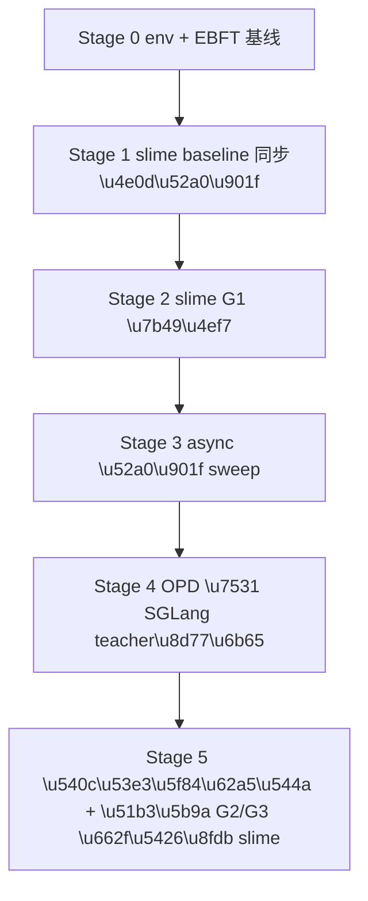

# Slime 渐进迁移 v3：先 baseline 再加速

## 核心原则

- 一步一步来，**没有 baseline 之前不动任何加速旋钮**。
- async、OPD、custom reward 都是**后期增益**，不在第一阶段引入。
- G1 先在 slime 上复刻，**G2/G3 是否进 slime 不在本 plan 决策**，等 G1 数据出来再说。
- 结论验证（G1/G2/G3 算法是否成立）继续走当前 OpenRLHF 脚本，**slime 只承担「加速 + 未来创新点」**。

## slime 在你这里的角色定位（一句话回答你的问题）

slime 在本项目中只承担 **训练加速引擎 + 未来创新点（OPD/async/feature reward）的实验底座**；不承担 G1/G2/G3 现有结论的验证。

## 阶段全景

## Stage 0 锁环境 + 量化「1 epoch 太慢」（前置必做）

- 锁定 `[slime/scripts/models/qwen3.5-4B.sh](/mnt/data/distribution-matching-slime/code/slime-0.2.4/slime/scripts/models/qwen3.5-4B.sh)` 作为唯一 MODEL_ARGS 来源，禁用 `[run_slime_gspo_1node_once.sh](/mnt/data/ebft-distribution-new/code/scripts/diff_dataset/run_slime_gspo_1node_once.sh)` 自动从 `config.json` 推断的分支。
- 记录现 OpenRLHF G1 跑 1 epoch 的 wall-clock 和四段时间（rollout / make_experience / actor train / save），明确「太慢」的具体数字，作为后面对比的 X 轴。
- 校验 slime/Megatron/SGLang/sgl-kernel/mbridge 版本、Qwen3.5-4B `torch_dist` 是否就绪。

输出：`baselines.tsv`、`audit_report.md`。

## Stage 1 slime baseline（同步，不加速，不 OPD，不 custom reward）

- 启动：`train.py`（同步），colocate=true，沿用 `[run_slime_gspo_1node_once.sh](/mnt/data/ebft-distribution-new/code/scripts/diff_dataset/run_slime_gspo_1node_once.sh)` 但关闭 `USE_EBFT_CUSTOM_RM`，`RM_TYPE=deepscaler` 或 `nonempty`。
- 数据：复用现有 `[prepare_code_datasets.py](/mnt/data/ebft-distribution-new/code/scripts/diff_dataset/prepare_code_datasets.py)` + `[prepare_slime_jsonl.py](/mnt/data/ebft-distribution-new/code/scripts/diff_dataset/prepare_slime_jsonl.py)`。
- 训练规模：先小步数（NUM_ROLLOUT≈10），目标只看「能跑通 + checkpoint 能转回 HF + HumanEval pass@1 不崩」。
- 转 HF + sanity check：`[convert_slime_checkpoint.sh](/mnt/data/ebft-distribution-new/code/scripts/diff_dataset/convert_slime_checkpoint.sh)` `mcore_to_hf`，HF pass@1 ≥ baseline - 1pt。

Stop 准则：能稳定复跑、checkpoint round-trip 不崩。**未通过不进入 Stage 2**。

## Stage 2 slime 上等价 G1（pointwise reward）

- 打开 `USE_EBFT_CUSTOM_RM=true`、`GROUP_RM=true`、`EBFT_RM_MODE=pointwise`，指向 `[slime_ebft_custom_rm.py](/mnt/data/ebft-distribution-new/code/scripts/diff_dataset/slime_ebft_custom_rm.py)` 的 `batched_custom_rm`。
- 不去复刻 strided block 几何，**接受整段近似**（plan 不要求和 OpenRLHF G1 数值一致，要求 pass@16 在同 token 预算下 ≥ baseline + 1pt 的「方向一致」即可）。
- 训练规模：跑到与 OpenRLHF G1 同等 token 预算的一半，量化「同等成本 slime 是否更快」。

Stop 准则：HumanEval/MBPP pass@16 方向一致；slime 每 step wall-clock 已经低于 OpenRLHF G1 的同 step wall-clock。

## Stage 3 async 加速（在 Stage 2 baseline 之上做单因子比较）

- 改资源拓扑：`--colocate` 关掉、actor 与 rollout 拆卡（如 4+4）。
- 启动改 `train_async.py`，其他参数照搬 Stage 2。
- 单因子顺序：先只切同步→异步对比一次；通过后再依次试 `--update-weights-interval`、`--use-dynamic-batch-size + --max-tokens-per-gpu`、`--balance-data`、`--async-save`、`--sglang-mem-fraction-static`、`--sglang-server-concurrency`。
- 每项保留与否的 stop 准则：**对 step wall-clock 改善 >5% 才保留**；保留项写进固定脚本。

输出：`speed_sweep.tsv`，包含同步与异步在相同 pass@16 下的训练时间差。

## Stage 4 OPD（按你「一步一步来」的要求，放在 baseline 之后才上）

- 先用最便宜形态：`--use-opd --opd-type sglang`，teacher 用一份现成 HF 模型起一个 SGLang server，**不另开 Megatron teacher**。
- 目标只是验证「teacher 介入是否真的对 pass@16 / 收敛速度有帮助」，**不**承诺这就是最终蒸馏路线。
- 与 Stage 3 的 async 配置叠加，单次只对比「Stage 3 配置 vs Stage 3 配置 + OPD」。
- 若 OPD-sglang 有正向收益，再考虑 `--opd-type megatron` 作为论文最终态。

## Stage 5 同口径报告 + 决策 G2/G3 是否进 slime

- X 轴：训练消耗 token 数（不是 step 序号）。
- Y 轴：HumanEval pass@16、MBPP pass@16、1k token 训练 wall-clock。
- 报告对象：`baseline_qwen35_4b`、`g1`_*（OpenRLHF 原产物）、`slime_baseline`（Stage 1）、`slime_g1_equiv`（Stage 2）、`slime_async`（Stage 3）、`slime_opd`（Stage 4）。
- 根据 Stage 2 与 Stage 3 的实际差距，**再决定**是否在 slime 上做 G2/G3 等价（不在本 plan 决策范围内）。

## 不在本 plan 做的事

- 不复刻 EBFT strided block / critic hidden / CF reward。
- 不在 slime 上验证 G2/G3 算法成立性。
- 不动 OpenRLHF G1/G2/G3 主脚本与现有评测脚本。
- 不上 fully_async（与 eval 模式冲突，且当前 baseline 尚未确立）。

## 可并行 agent 分工

| Agent          | 任务                                  | 何时启动               |
| -------------- | ----------------------------------- | ------------------ |
| env-audit      | Stage 0 依赖/checkpoint/MODEL_ARGS 锁定 | 立即                 |
| ebft-baseline  | Stage 0 跑 OpenRLHF G1 四段时间          | 立即，与 env-audit 并行  |
| slime-baseline | Stage 1 同步闭环 + round-trip           | env-audit 完成后      |
| slime-g1-equiv | Stage 2 pointwise reward            | slime-baseline 通过后 |
| async-sweep    | Stage 3 async + 单因子 sweep           | slime-g1-equiv 通过后 |
| opd-pilot      | Stage 4 OPD-sglang 试跑               | async-sweep 出结果后   |
| compare-report | Stage 5 同口径报告                       | 各阶段产物到位后           |

