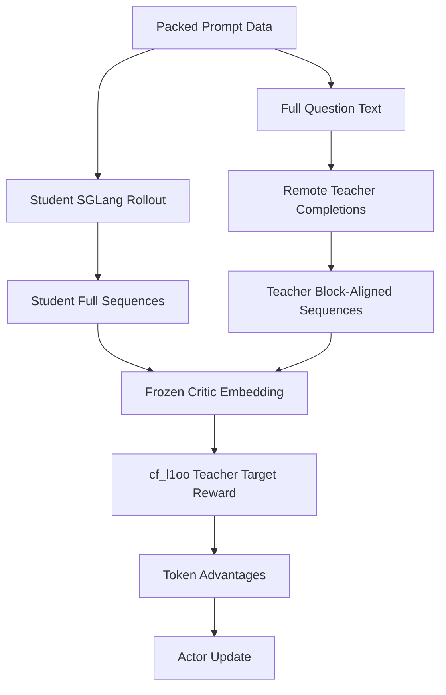

# Slime 对齐 OpenRLHF EBFT G2 进度说明

## 结论摘要

当前 Slime 已经接入 **OpenRLHF EBFT 标准 G2 的最小工程闭环**，并且已经完成一次 `NUM_ROLLOUT=1` smoke 跑通。这个结论只表示 G2 标准训练链路在 Slime 里能端到端活下来，不表示训练效果、OpenRLHF 全链路数值 parity 或 post-eval 已完成。

当前已验证：

- 标准 G2 smoke 已成功跑通，Ray job succeeded。
- G2 teacher 默认改为 Slime/SGLang `/generate` 后端，不再要求 OpenAI `/v1/completions` 服务。
- CPU parity 已覆盖 teacher block layout、student whitening / teacher unwhitened 输入语义、`cf_l1oo` reward、expanded token advantages 和 scalar rewards，OpenRLHF expected 与 Slime actual 的 diff 为 0。

仍未完成：

- 真实 Megatron hidden / embedding dump parity。
- 与 OpenRLHF `run_G2_rebase_2node_once.sh` 的端到端同 prompt / 同 teacher completion / 同 reward dump 对齐。
- Teacher prefetch。
- 训练后 code benchmark / MBPP / HumanEval post-eval 对齐。

## OpenRLHF EBFT 标准 G2 做了什么

标准 G2 的事实源是 `/mnt/data/ebft-distribution-new/code/scripts/diff_dataset/run_G2_rebase_2node_once.sh` 以及其调用的 OpenRLHF 模块。

标准 G2 配方：

| 维度 | 标准 G2 |
| --- | --- |
| 分布奖励 | `distribution_reward_type=cf_l1oo` |
| CF target | `cf_target_mode=teacher` |
| Teacher | remote completion teacher，原 OpenRLHF 脚本使用 vLLM/OpenAI-compatible completions |
| Teacher 样本数 | `cf_teacher_n_samples=M`，不要求等于 student `n_samples_per_prompt=N` |
| Teacher 混合权重 | `cf_teacher_lambda=0.6` 默认 |
| Critic | `critic_learning_rate=0`、`critic_lr_head=0`，冻结，用于提供 embedding |
| Feature | 标准 G2 不启用 feature adapter / EMA |
| 辅助损失 | 标准 G2 不启用 CE、diversity/alignment、direct discrepancy |
| ZeRO | G2 脚本使用 ZeRO-3 |

关键函数与职责：

| 文件 | 关键职责 |
| --- | --- |
| `/mnt/data/ebft-distribution-new/code/openrlhf/cli/train_ebft_ray.py` | 解析 `cf_l1oo`、teacher、critic、Ray actor group 等训练参数。 |
| `/mnt/data/ebft-distribution-new/code/openrlhf/trainer/ppo_utils/ebft_experience_maker.py` | G2 经验构造主路径：student rollout、remote teacher completion、teacher block 对齐、critic embedding、reward。 |
| `/mnt/data/ebft-distribution-new/code/openrlhf/utils/embedding_utils.py` | `whiten_embeddings_batched`、`get_cf_l1oo_rewards`、teacher target empirical measure 构造。 |
| `/mnt/data/ebft-distribution-new/code/openrlhf/trainer/ray/ebft_critic.py` | 冻结 critic forward，提供 hidden states / embedding 相关输出。 |
| `/mnt/data/ebft-distribution-new/code/openrlhf/utils/teacher_provider.py` | Remote teacher completions、cache、多 worker 调度。 |
| `/mnt/data/ebft-distribution-new/code/openrlhf/utils/teacher_prefetch.py` | teacher completion 预取优化，不改变 G2 reward 定义。 |

标准 G2 数据流：



## 当前 Slime 改动逐文件说明

以下说明基于当前工作区未提交改动。

### `slime/utils/g2_core.py`

新增 G2 reward core：

- `compute_cf_l1oo_rewards` 对齐 OpenRLHF `get_cf_l1oo_rewards`。
- 支持 teacher target：GT 重复 `r` 次 + `M` 个 teacher embedding 拼接，近似 `cf_teacher_lambda`。
- 支持 `M != N`。
- 返回 shape 为 `(B, G, N, K)` 的 block reward。

### `slime/rollout/g2_teacher.py`

新增 G2 remote teacher client：

- 支持 `completions`、`chat_completions`、`sglang_generate`。
- 当前 G2 smoke 默认使用 `sglang_generate`，即 POST SGLang `/generate`。
- 对 SGLang 后端，默认通过一次 `/generate` 请求携带 `sampling_params.n=M` 获取 M 条 teacher completion；若服务不支持该格式，会回退为并发单样本请求。
- 支持 SQLite cache，cache key 包含 prompt、model、采样参数、system prompt id/text。
- 失败日志包含 URL 和底层错误，便于定位 teacher 服务问题。

### `slime/rollout/sglang_rollout.py`

在每个 prompt group 的 student rollout / reward 后，标准 G2 会调用：

- `attach_g2_teacher_completions(args, group)`

这会把同一组 teacher completions 写入 group 内所有 student sample 的 metadata，保证同 prompt group 共享 teacher target。

### `slime/rollout/g1_embedding.py`

新增 `build_g1_teacher_full_sequence_inputs`：

- 将 teacher completion token 写回 packed prompt 的 answer span。
- 短答案补 pad，长答案截断到 answer span。
- 再按 OpenRLHF 的 stride/block 方式构造 response region。
- `full_sequence` 的 prompt 部分保持原始 prompt，response 部分来自 teacher prompt 的 block unfold。
- `qa_mask` 的 response 部分同样来自 strided QA mask，而不是简单全 1。

这是 G2 teacher completion -> teacher embedding 的关键契约。

### `slime/ray/rollout.py`

在 train data 转换阶段新增 G2 teacher 数据：

- 从 `sample.metadata["g2_teacher_completions"]` 构建 `g2_teacher_full_sequences`。
- 构建 `g2_teacher_qa_masks`。
- 保证同 prompt group 内 teacher completions 一致。
- 继续保留 `g1_full_sequences` / `g1_qa_masks`，用于 student gen/gt embedding。

### `slime/backends/megatron_utils/g1_fast.py`

扩展 trainer-side G1 embedding path，使其支持标准 G2：

- `distribution_reward_type=cf_l1oo` 时进入 G2 分支。
- 要求 `cf_target_mode=teacher`。
- 对 student `gen/gt` 做 OpenRLHF 风格 whitening。
- teacher embedding 不参与 whitening，保持 OpenRLHF G2 语义。
- 允许 `M != N`。
- 计算 `cf_l1oo` block rewards，并展开成 token advantages。

### `slime/backends/megatron_utils/actor.py`

标准 G2 改为 critic-side reward / advantage 计算：

- critic 在 `train_critic` 中先 forward values。
- 标准 G2 下，critic 继续计算 teacher embeddings、student gen/gt embeddings、`g1_token_advantages` 和 scalar `rewards`。
- actor 标准 G2 下不再切换到 ref 来计算 G2 reward。
- 非标准 G2 的 G1 pointwise 路径仍保持 ref snapshot 行为。

### `slime/backends/megatron_utils/data.py`

扩展 actor / critic 同步：

- 标准 G2 下，critic 计算出的 `g1_token_advantages` 和 `rewards` 从 critic 广播给 actor。
- 原有 `values` / logprobs 同步逻辑保留。

### `slime/ray/placement_group.py`

标准 G2 下：

- 因为 embedding 在 critic 侧完成，actor 不再因 `g1_embedding_source=megatron_ref` 自动加载 ref。
- G1 pointwise trainer-side path 仍需要 actor/ref。

### `slime/utils/arguments.py`

新增标准 G2 参数面：

- `--distribution-reward-type cf_l1oo`
- `--cf-target-mode teacher`
- `--cf-teacher-lambda`
- `--cf-teacher-n-samples`
- `--teacher-backend remote`
- `--teacher-api-style completions|chat_completions|sglang_generate`
- `--teacher-api-base`
- `--teacher-cache-enable`
- `--critic-lr-head`

并新增 `assert_g2_standard_args`，明确禁止把标准 G2 与 OPD、G3、CE、非 teacher target 混用。

### `exper_scripts/smoketest/run_g2_openrlhf_qwen35_2b_smoke.sh`

新增标准 G2 smoke：

- 默认 teacher 后端为 SGLang `/generate`：
  - `TEACHER_API_STYLE=sglang_generate`
  - `TEACHER_API_BASE=http://127.0.0.1:30000`
- 默认 G2 核心参数：
  - `cf_l1oo`
  - `cf_target_mode=teacher`
  - `cf_teacher_lambda=0.6`
  - `critic-lr=0`
  - `critic-lr-head=0`
  - `zero-stage=3`
  - `use-whitening`
- 默认 8 卡建议拆分为 teacher 2 卡、G2 训练 6 卡。
- 支持 teacher preflight。
- 显式传 `--critic-save`，避免 critic checkpoint path 为 `None`。

### `tests/test_g1_core.py`

新增 G2 相关单测/样例：

- teacher full sequence layout。
- train data 中 G2 teacher sequences 构造。
- `cf_l1oo` shape / reward 非零。
- `M != N`。
- teacher cache key。
- SGLang `/generate` teacher 请求行为。

当前 pytest 受环境 `ray` import 影响，完整测试文件不能直接收集执行。

### `refactor_debugging/g2_parity/compare_g2_reward_core.py`

新增 G2 CPU number parity 脚本，不依赖 GPU/Ray/训练：

- layout parity。
- reward input parity。
- final reward/token advantage parity。

当前运行结果全部通过，OpenRLHF expected 与 Slime actual 的具体数值完全一致，diff 为 0。

## 当前已验证结果

### 1. G2 smoke 已跑通

`NUM_ROLLOUT=1` 的 G2 smoke 已成功：

```text
Job 'raysubmit_pM1ah29zWpRc93LL' succeeded
```

它覆盖了：

- student rollout。
- teacher SGLang `/generate` completion。
- teacher block-aligned sequence。
- critic-side embedding/reward/advantage。
- critic -> actor 同步。
- actor training。
- actor -> rollout SGLang weight update。
- actor / critic checkpoint save。

### 2. CPU number parity 已通过

运行：

```bash
python refactor_debugging/g2_parity/compare_g2_reward_core.py
```

结果：

```text
all_passed = true
max_abs_diff = 0.0
mean_abs_diff = 0.0
```

具体覆盖：

- `layout parity`
- `reward input parity`
- `final reward/token advantage parity`

示例 scalar rewards：

```text
OpenRLHF expected:
[0.1219534427, 0.2170764804, -0.0050130263, 0.1346538961, -0.0454849750, 0.2274308205]

Slime actual:
[0.1219534427, 0.2170764804, -0.0050130263, 0.1346538961, -0.0454849750, 0.2274308205]
```

示例 token advantages：

```text
OpenRLHF expected:
[
  [0.1357232183, 0.1081836596, 0.1357232183, 0.1081836596],
  [0.1578229219, 0.2763300538, 0.1578229219, 0.2763300538],
  [0.0285262316, -0.0385522842, 0.0285262316, -0.0385522842],
  [-0.0152841285, 0.2845919132, -0.0152841285, 0.2845919132],
  [-0.0026420280, -0.0883279219, -0.0026420280, -0.0883279219],
  [0.3281642795, 0.1266973615, 0.3281642795, 0.1266973615]
]

Slime actual:
same as expected
```

## G1 / G2 / G3 边界

### G1

G1 是 no-teacher、pointwise reward：

- `distribution_reward_type=pointwise`
- `cf_target_mode=single`
- 无 remote teacher completion
- 使用 alignment/diversity + RLOO 逻辑

### 标准 G2

标准 G2 是本说明文档关注的路径：

- `cf_l1oo`
- `cf_target_mode=teacher`
- online teacher completions
- frozen critic embedding
- 无 G3 extras

### G3

G3 是标准 G2 之上的增强，不属于当前实现目标：

- EMA
- feature adapter
- 可训练 critic head/backbone
- direct discrepancy
- classifier auxiliary loss
- CE loss
- diversity/alignment 等额外项

### OPD

OPD 不等于标准 G2：

- OPD teacher 给的是 student completion 的 token log-probs。
- 标准 G2 teacher 给的是 M 条 teacher completions，进入 embedding target distribution。

因此 OPD 可以作为更快的 distillation 变体，但不能声称对齐标准 G2。

## 仍未完成 / 风险项

| 项目 | 当前状态 |
| --- | --- |
| Megatron hidden / embedding dump parity | 未完成。当前 CPU parity 覆盖布局和 reward 输入语义，但未比较真实 Megatron hidden 数值。 |
| OpenRLHF 端到端同批次对照 | 未完成。还没有用同 prompt / 同 teacher completions 跑 OpenRLHF 与 Slime 双边 dump。 |
| Teacher batching | 已接入。`sglang_generate` 默认单请求多采样，失败时回退到按 `teacher_remote_batch_size` 控制的并发单采样。 |
| Teacher prefetch | 未完成。OpenRLHF G2 有 prefetch wrapper，Slime 当前没有接入同等优化。 |
| Post-eval | 未完成。尚未对齐 OpenRLHF G2 的 code benchmark post-eval。 |
| 训练效果 | 未验证。smoke 只验证工程链路，不验证模型质量。 |
| G1 遗留差异 | Slime 仍有 chat template、字段名、KL/entropy、dense mask 默认等与 OpenRLHF G1/G2 数据侧差异。 |

## 下一步建议

1. 做真实 dump parity：
   - 固定 prompt / label / teacher completions。
   - Slime dump student gen/gt embeddings、teacher embeddings、cf rewards、token advantages。
   - OpenRLHF dump 同一层数据。
   - 逐层比较 diff。

2. 压测 teacher batching：
   - 对比 `TP=4,DP=2` 和 `TP=2,DP=4` 的 1node8 卡 teacher 服务。
   - 观察 `sglang_generate` 单请求多采样、回退并发单采样以及不同 `TEACHER_REMOTE_BATCH_SIZE` 的吞吐差异。

3. 补 teacher cache / prefetch 观察指标：
   - cache hit/miss。
   - teacher request latency。
   - rollout wait time。

4. 做短训练稳定性：
   - `NUM_ROLLOUT=5` 或更小数据子集。
   - 观察 reward 分布、advantage 分布、actor loss、weight update。

5. 对齐 post-eval：
   - 接 `run_code_generation_benchmarks.py` 或 Slime eval config。
   - 明确 MBPP/HumanEval 口径。
