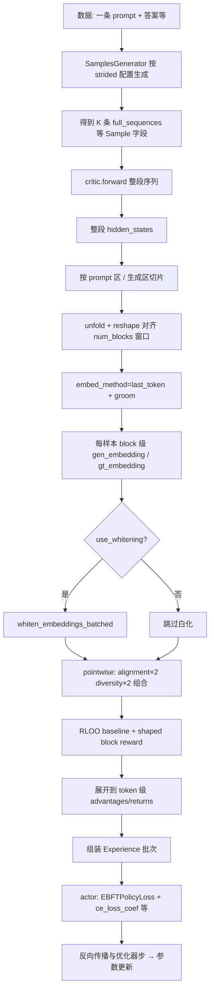
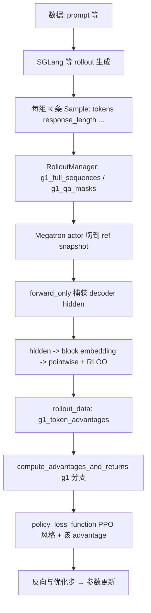
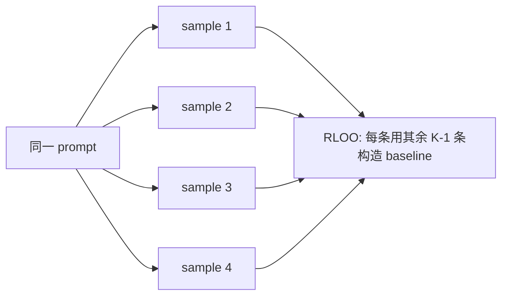

# G1：从一条 Prompt 到参数更新（流程说明）

本文只讨论 **OpenRLHF diff-dataset G1**（`pointwise` + `cf_target_mode=single` + RLOO + whitening + frozen critic）以及 **slime 侧要对齐的 G1 目标形态**。同一文件里画两条链，便于对照「embedding / reward 在哪一步出现」。

当前实现状态：slime 已完成 reward/RLOO/token advantage 的固定 embedding 与 helper-level parity；慢 HF/OpenRLHF path 已可按契约写入 metadata，但因 Qwen3.5 `transformers` / SGLang 环境冲突被暂停为 correctness stash。当前活动路线是 **Megatron/fast embedding path**：SGLang rollout 只生成固定长度 completion，RolloutManager 准备 `g1_full_sequences` / `g1_qa_masks`，Megatron actor 在训练侧切到 frozen `ref` snapshot 捕获 hidden，再完成 groom、reward/RLOO 与 `g1_token_advantages`。完整 `prompt -> Megatron ref hidden -> groom` 的 runtime parity 仍要单独用 dump/对照推进。

---

## 0. 名词（G1 语境）


| 名词                   | 含义                                                                                                                                     |
| -------------------- | -------------------------------------------------------------------------------------------------------------------------------------- |
| **一条 prompt**        | 数据里的一条训练样本（如 `question`），会派生出 **K = n_samples_per_prompt** 条不同 completion（同 prompt、多采样）。                                               |
| **strided block**    | 按 `context_max_len`、`generate_max_len`、`stride` 在序列上滑动的生成块；`num_blocks` 由几何公式确定。                                                       |
| **block 级向量**        | 每个 block 上从 critic hidden **聚合** 得到的一个向量（G1 常用 `last_token` + groom），形状语义为 `[num_blocks, hidden_dim]`（实现里可能先带 `generate_length` 维再压掉）。 |
| **pointwise reward** | 对每个 block：对齐项（cosine×2）− 多样性项（组内点积均值×2），再乘系数后组合。                                                                                       |
| **RLOO**             | 在「同一 prompt 的 K 条样本」上做 leave-one-out baseline，得到 shaped block reward。                                                                  |
| **token advantage**  | 把每个 block 的标量 shaped reward **按 OpenRLHF 规则** 展开到该 block 内每个生成 token（`repeat(1, generate_max_len)` 那种顺序）。                              |


---

## 1. OpenRLHF G1：从 prompt 到 actor 更新（主路径）

整体是 **Ray + DeepSpeed 策略** 下的训练循环；下面抽象成「逻辑顺序」，不展开所有 Ray actor 细节。




### 1.1 文字按步梳理（与代码对应）

1. **输入**
  一条 prompt（及 label）进入数据集 / batch；`n_samples_per_prompt`（如 4）表示 **同一 prompt 要采 4 条 completion**。
2. **Rollout（strided 生成）**
  `SamplesGenerator` 等按 `prompt_max_len / context_max_len / generate_max_len / stride` 做多块生成，得到 `full_sequences`**、**`action_mask` 等（具体类名见 `ebft_experience_maker.py` / generator）。
3. **Critic（冻结，仍前向）**
  `make_experience` 里对 `**full_sequences_list`** 调 critic 的 `forward`（见 `ebft_experience_maker.py` 中 `async_run_method_batch(..., method_name="forward", sequences=full_sequences_list, ...)`）。  
   **要点**：一次前向是 **整段序列**；strided 不是「只把一小块喂进 critic 且看不见上下文」，而是 **整段进网络，再在 hidden 的时间维上按窗口切 block**。
4. **从整段 hidden 到 block 级向量**
  在 `make_experience` 内对 `critic_hidden_states_tensor` 做切片、`unfold`、`reshape`，再 `embed_method == "last_token"` 时经 `**groom`**，得到 **每个样本、每个 block 一个用于 reward 的向量**（与后面的 pointwise 对齐/多样性在同一几何下）。
5. **Pointwise + whitening**
  可选 `whiten_embeddings_batched`；然后 `get_alignment_rewards`、`get_diversity_rewards`，以及 OpenRLHF 里对 pointwise 的 **×2** 与系数组合（见 `make_experience` pointwise 分支）。
6. **RLOO**
  `compute_baseline` + `raw_rewards - baseline` → shaped block 级 reward（与 `advantage_estimator=rloo` 路径一致）。
7. **展开到 token**
  `compute_advantages_and_returns` 中：对 2D shaped reward 做 `**repeat(1, generate_max_len)`**，把每个 block 的标量铺到该块的 `generate_max_len` 个 token 上，再写入 full-length 的 `advantages`/`returns`（生成尾段非零，prompt 段为 0）。
8. **Actor 更新**
  `**EBFTPolicyLoss`**（与标准 PPO clip 不同）+ `**ce_loss_coef**`（diff_dataset G1 脚本里为 0.03）等对 prompt/QA 区域的 CE；反向传播更新 **actor**（critic 学习率为 0 时不更新 critic）。

---

## 2. Slime 目标 G1：从 prompt 到 actor 更新（当前 active 形态）

slime 默认 **Megatron actor + SGLang rollout**；当前 active G1 path 是 **trainer-side Megatron/ref embedding**。rollout 不再写大 embedding metadata，也不走 rollout-side `group_rm/custom_rm`；它只生成固定 376-token response，并在 train data 中带上 `g1_full_sequences` / `g1_qa_masks`。训练侧切到 frozen `ref` snapshot forward hidden，随后直接写 `g1_token_advantages`。




### 2.1 与 OpenRLHF 的关键差异（只看 G1）


| 环节                   | OpenRLHF G1                                                 | Slime G1（当前设计）                                                                                                                     |
| -------------------- | ----------------------------------------------------------- | ---------------------------------------------------------------------------------------------------------------------------------- |
| **Embedding 从哪来**    | `make_experience` 里 critic 整段 forward 后 **切窗口 + groom**。    | 当前 active path 用 Megatron `ref` hidden；旧 rollout metadata embedding 只保留为 slow/correctness stash。 |
| **Pointwise + RLOO** | 在 `**RemoteExperienceMaker.make_experience`**。              | trainer-side `g1_fast.py` 调 `slime/utils/g1_core.py`；旧 rollout-side `rm_hub/g1_core.py` 仍可验证同一数学。 |
| **Token advantage**  | `ebft_experience_maker` 里 `compute_advantages_and_returns`。 | trainer-side 直接写 `rollout_data["g1_token_advantages"]`，训练侧 `advantage_estimator=g1` 消费。 |
| **Actor 损失**         | `**EBFTPolicyLoss`** + CE 项。                                | **Megatron `policy_loss_function`**（PPO 风格 ratio/clip 等），**未自动换成 EBFT loss**；若要对齐论文/原脚本需额外改。                                       |


---

## 3. 单条 prompt 在「组内 K 条样本」里的关系（两边共通）




G1 的 **多样性 reward** 也依赖 **同一 prompt 下多条 completion** 的组内比较；因此 trainer-side DP split 必须保持 **组大小 = `n_samples_per_prompt`** 的 prompt group 不被拆散。旧 rollout-side RM 路径用 `--group-rm` 表达同一语义；当前 Megatron/ref path 通过 group-aligned DP split 保证这一点。

---

## 4. 参考路径（便于跳转）


| 项目                        | 文件                                                                       |
| ------------------------- | ------------------------------------------------------------------------ |
| OpenRLHF G1 经验与 embedding | `openrlhf/trainer/ppo_utils/ebft_experience_maker.py`（`make_experience`） |
| OpenRLHF 点积/白化            | `openrlhf/utils/embedding_utils.py`                                      |
| OpenRLHF 训练循环             | `openrlhf/trainer/ebft_trainer.py`（`make_experience_batch` → actor）      |
| diff-dataset G1 启动参数      | `scripts/diff_dataset/run_G1_rebase.sh`                                  |
| Slime 主循环                 | `train.py`                                                               |
| Slime rollout + group RM  | `slime/rollout/sglang_rollout.py`、`slime/rollout/rm_hub/__init__.py`     |
| Slime G1 RM               | `slime/rollout/rm_hub/g1_core.py`                                        |
| Slime G1 数学               | `slime/utils/g1_core.py`                                                 |
| Slime 训练侧消费 advantage     | `slime/backends/megatron_utils/loss.py`（`advantage_estimator == "g1"`）   |


---

## 5. 你若只记一张图（OpenRLHF G1）

```
prompt
  → 多采样得到 K 条序列（strided 生成）
  → critic 整段 forward
  → 在 hidden 上按块切 + last_token → 每块一个向量
  →（可选）白化 → pointwise + RLOO（块级）
  → 展开到 token advantage
  → EBFT actor loss 更新参数
```

slime 要在 **不改动 OpenRLHF** 的前提下复刻 G1，核心就是把中间三步 **「critic 整段 → 块向量 → pointwise+RLOO+展开」** 在 slime 里用 **等价数据** 接到 `**g1_token_advantages`**，并清楚 **actor loss 是否要对齐 EBFT** 另作决策。第一版先固定 response length 为 376，不支持 truncation / stop early / 变长。